# Lab: Creación y ejecución de modelos AutoAI en IBM Watson Studio

## Objetivo

Documentar el proceso de creación, configuración y ejecución de un experimento de AutoAI en IBM Watson Studio, utilizando un dataset de crédito para generar modelos de Machine Learning orientados a la predicción de riesgo.

El objetivo principal fue utilizar AutoAI para entrenar y comparar modelos automáticamente, seleccionar el mejor resultado generado por la plataforma y revisar métricas de evaluación como la curva ROC y la matriz de confusión.

---

## Entorno utilizado

* IBM Cloud
* IBM Watson Studio
* IBM Watson Machine Learning
* IBM Cloud Object Storage
* AutoAI
* Navegador web
* Dataset: `german_credit_data_biased_training.csv`

---

## Descripción del laboratorio

En este laboratorio se continuó el trabajo iniciado en el proyecto `Risk_Fraud`, donde previamente se había creado un proyecto en IBM Watson Studio y se había cargado el dataset `german_credit_data_biased_training.csv`.

A partir de ese dataset, se creó un experimento de AutoAI llamado `Riesgo de préstamo`, con el propósito de generar modelos automáticos capaces de predecir la columna `Risk`.

AutoAI analizó el conjunto de datos, configuró el problema como una clasificación binaria, probó diferentes algoritmos, generó varias interconexiones/modelos y permitió revisar el rendimiento del modelo ganador mediante métricas visuales.

---

## Procedimiento realizado

### 1. Acceso al proyecto Risk_Fraud

Se ingresó al proyecto `Risk_Fraud` en IBM Watson Studio y se verificó que el dataset `german_credit_data_biased_training.csv` estuviera disponible en la pestaña **Activos**.

**Evidencia:**

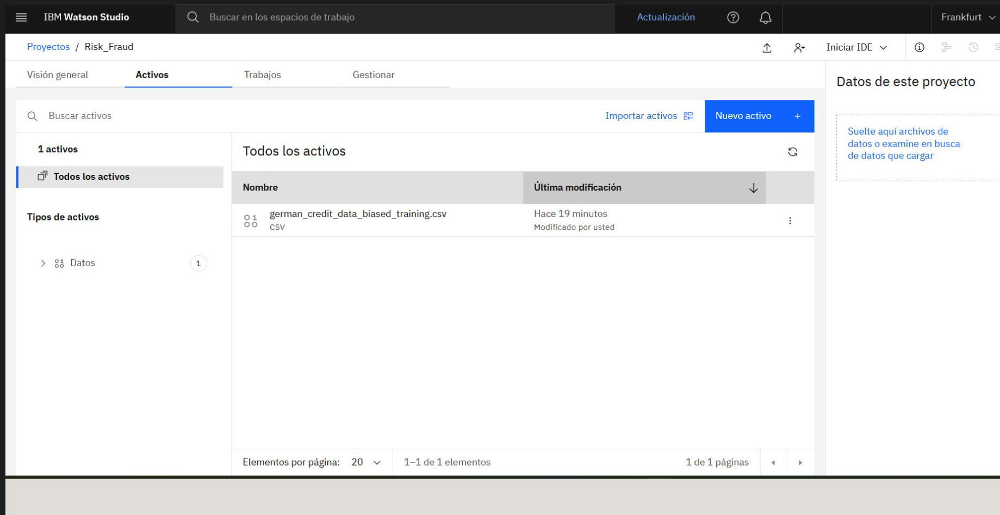

---

### 2. Selección de AutoAI

Desde la opción **Nuevo activo**, se seleccionó la categoría **Creadores automatizados** y luego la herramienta **AutoAI**.

AutoAI permite crear modelos de Machine Learning de forma automatizada a partir de datos tabulares.

**Evidencia:**

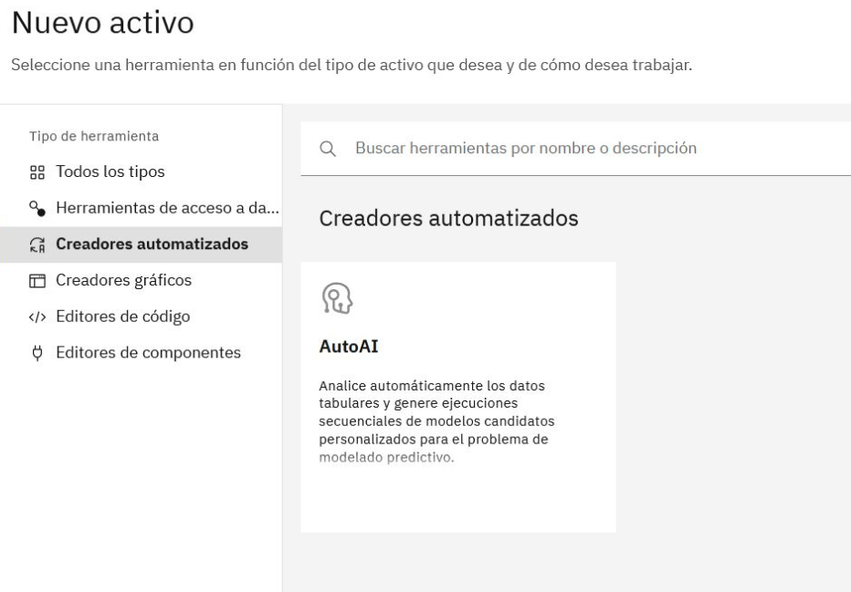

---

### 3. Creación del experimento AutoAI

Se creó un nuevo experimento de AutoAI y se le asignó el nombre:

`Riesgo de préstamo`

En esta etapa todavía no había una instancia de Watson Machine Learning asociada al experimento.

**Evidencia:**

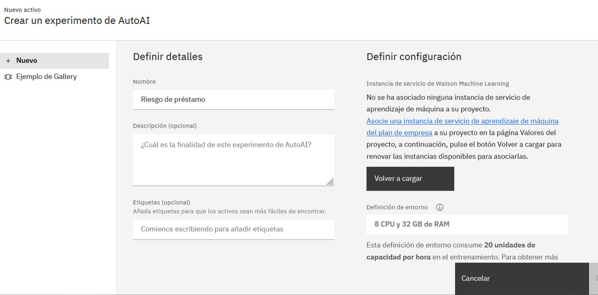

---

### 4. Servicio Watson Machine Learning disponible

Para ejecutar el experimento, fue necesario asociar una instancia de Watson Machine Learning.

La plataforma mostró disponible el servicio:

`Machine Learning-Risk_Fraud`

**Evidencia:**

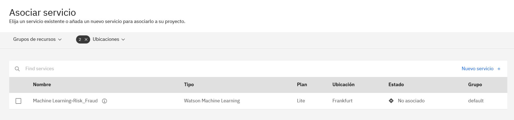

---

### 5. Selección del servicio Watson Machine Learning

Se seleccionó la instancia `Machine Learning-Risk_Fraud` para asociarla al experimento de AutoAI.

**Evidencia:**

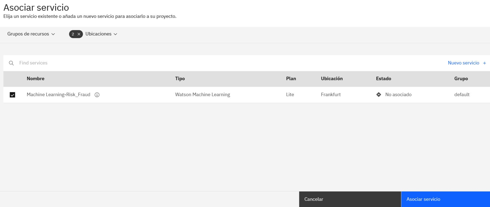

---

### 6. Asociación del servicio al experimento

Después de asociar y actualizar la configuración, el experimento mostró la instancia de Watson Machine Learning correctamente vinculada.

**Evidencia:**

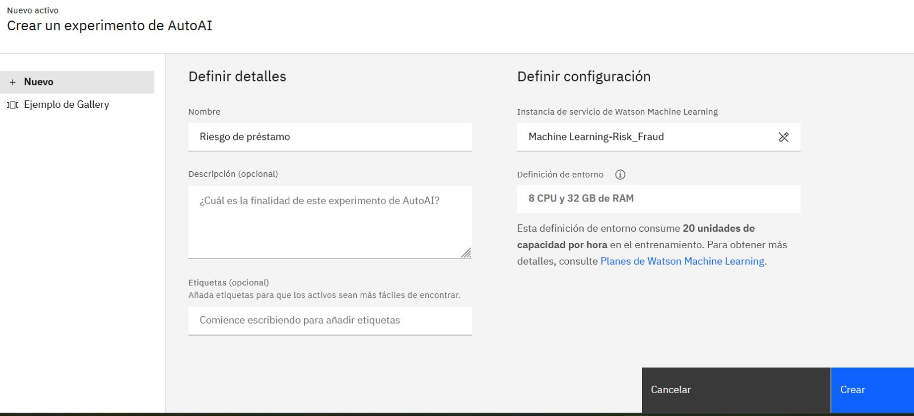

---

### 7. Experimento creado y selección del origen de datos

Una vez creado el experimento, se abrió la sección para añadir el origen de datos.

Se seleccionó la opción **Seleccionar datos del proyecto** para utilizar el dataset que ya estaba cargado en Watson Studio.

**Evidencia:**

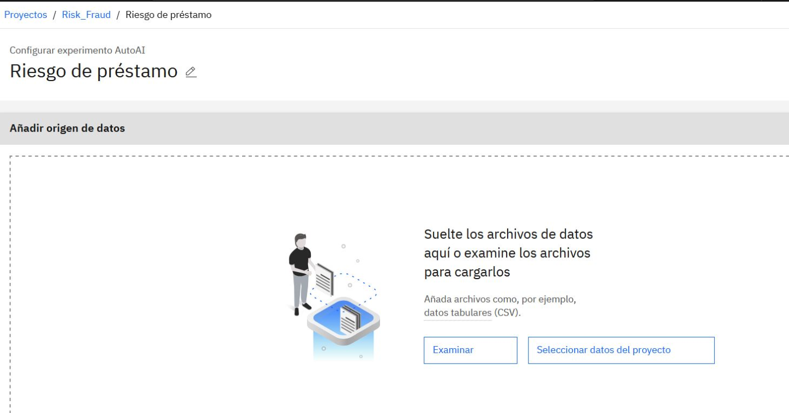

---

### 8. Dataset disponible como activo de datos

Dentro de los activos de datos del proyecto, se verificó que el archivo `german_credit_data_biased_training.csv` estuviera disponible para ser usado en el experimento.

**Evidencia:**

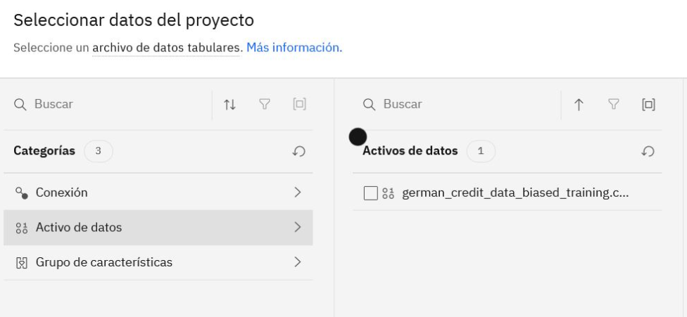

---

### 9. Dataset seleccionado

Se seleccionó el dataset `german_credit_data_biased_training.csv` como fuente de datos para el experimento AutoAI.

**Evidencia:**

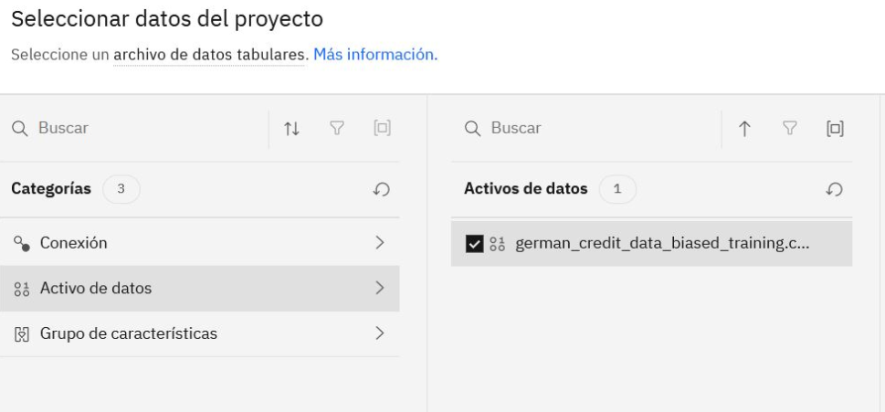

---

### 10. Configuración de serie temporal

AutoAI preguntó si se deseaba crear un análisis de serie temporal.

Para este laboratorio se seleccionó **No**, ya que el objetivo no era pronosticar valores en el tiempo, sino clasificar registros según riesgo crediticio.

**Evidencia:**

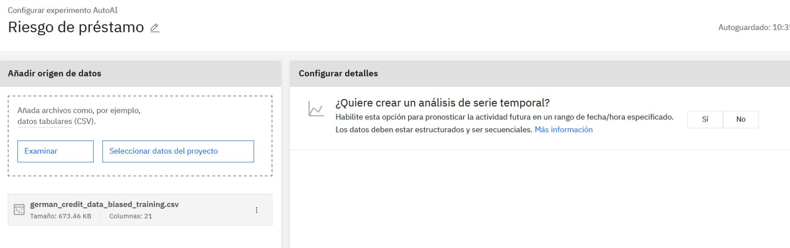

---

### 11. Selección de columna de predicción

Luego de indicar que no se trataba de una serie temporal, AutoAI solicitó seleccionar la columna que el modelo debía predecir.

**Evidencia:**

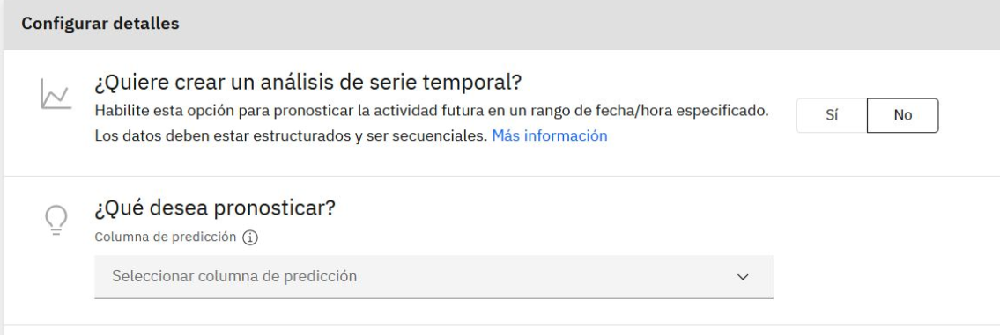

---

### 12. Columna objetivo Risk y clasificación binaria

Se seleccionó la columna `Risk` como columna de predicción.

AutoAI identificó automáticamente el problema como una **clasificación binaria**, ya que el modelo debe clasificar los registros en dos posibles categorías:

* `Risk`
* `No Risk`

**Evidencia:**

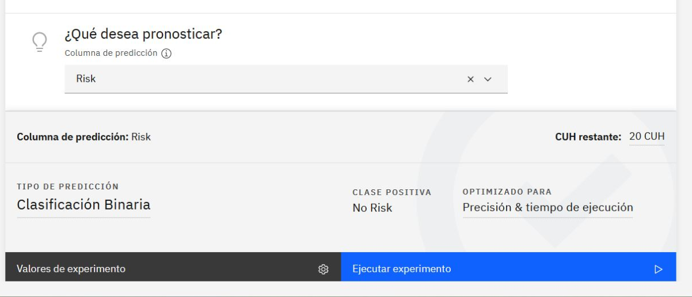

---

### 13. Revisión de valores generales de predicción

Se revisaron los valores generales del experimento:

* Tipo de predicción: **Clasificación binaria**
* Clase positiva: **No Risk**
* Métrica optimizada: **Precisión**

**Evidencia:**

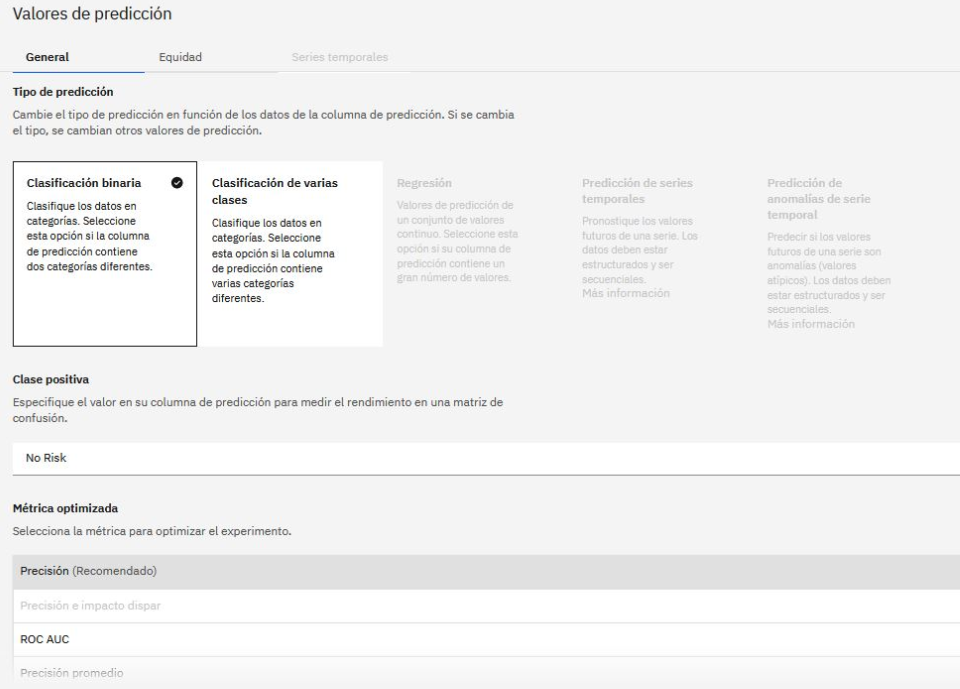

---

### 14. Selección de algoritmos AutoAI

En la configuración del experimento se revisaron los algoritmos que AutoAI podía incluir.

Se seleccionó el algoritmo **Clasificador de aumento de gradiente**, junto con otros algoritmos disponibles para que AutoAI pudiera comparar diferentes modelos.

**Evidencia:**

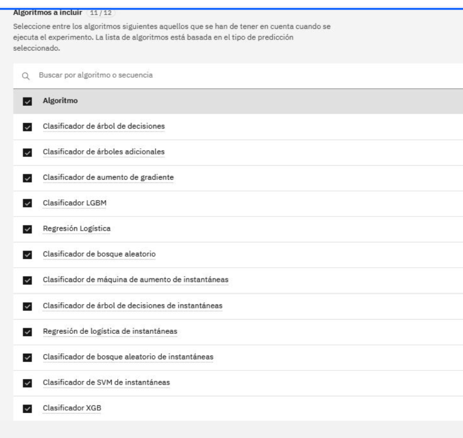

---

### 15. Exclusión de la característica Telephone

En la sección de origen de datos se revisaron las características del dataset que serían utilizadas por el modelo.

Se excluyó la característica `Telephone`, por lo que esta columna no fue utilizada para entrenar el experimento.

**Evidencia:**

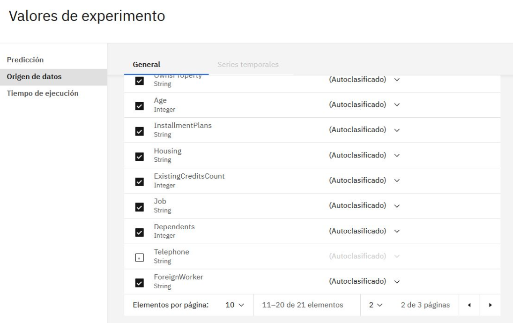

---

### 16. Experimento listo para ejecutar

Después de guardar los valores del experimento, AutoAI mostró la configuración principal lista para ejecutarse.

La configuración incluía:

* Dataset cargado
* Columna de predicción: `Risk`
* Tipo de predicción: clasificación binaria
* Clase positiva: `No Risk`
* Optimización por precisión y tiempo de ejecución

**Evidencia:**

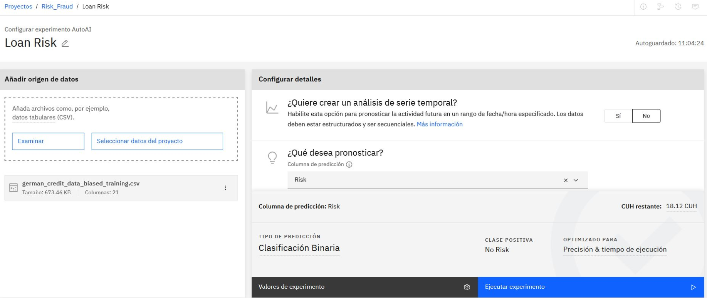

---

### 17. Ejecución del experimento AutoAI

Se inició la ejecución del experimento mediante la opción **Ejecutar experimento**.

Durante esta etapa, AutoAI comenzó a procesar los datos y a construir modelos automáticamente.

**Evidencia:**

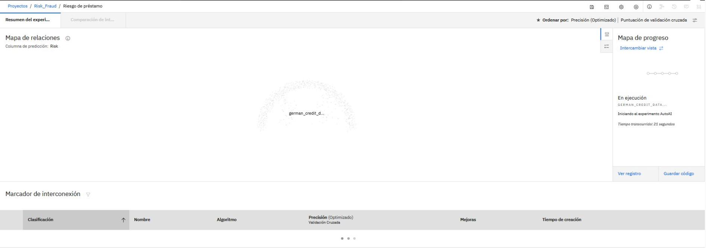

---

### 18. Mapa de progreso de AutoAI

Se revisó el mapa de progreso del experimento, donde AutoAI muestra las etapas internas del proceso:

* Lectura del conjunto de datos
* División de datos
* Preprocesamiento
* Selección de modelo
* Optimización de hiperparámetros
* Ingeniería de características

**Evidencia:**

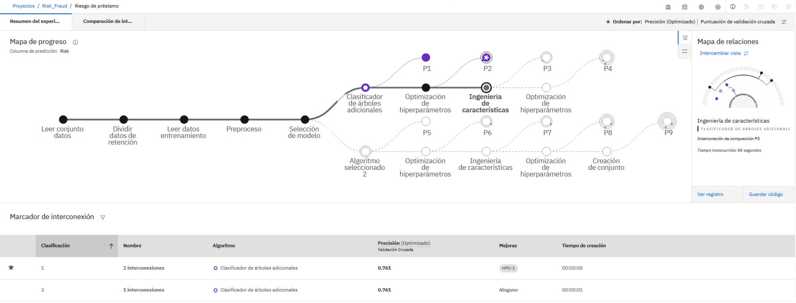

---

### 19. Experimento AutoAI completado

El experimento finalizó correctamente.

AutoAI generó varias interconexiones/modelos y mostró el estado **Experimento completado**.

**Evidencia:**

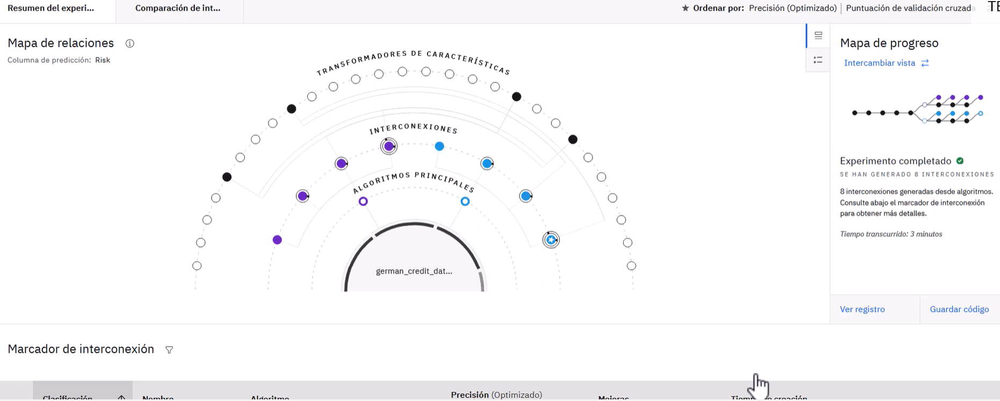

---

### 20. Modelos generados por AutoAI

AutoAI generó 8 interconexiones/modelos y ordenó los resultados según la métrica de precisión.

El modelo ganador apareció marcado con una estrella.

El mejor resultado mostrado fue:

* Algoritmo: **Clasificador de bosque aleatorio**
* Precisión optimizada: **0.776**
* Mejoras aplicadas: **HPO-1, FE, HPO-2**

**Evidencia:**

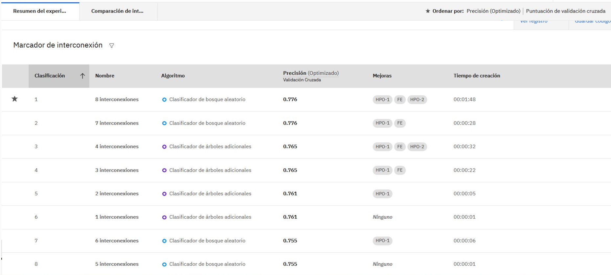

---

### 21. Revisión de la curva ROC

Se abrió el modelo ganador para revisar sus detalles.

En la sección de evaluación del modelo, IBM Watson Studio mostró la **curva ROC**, utilizada para visualizar el comportamiento del modelo al distinguir entre clases.

**Evidencia:**

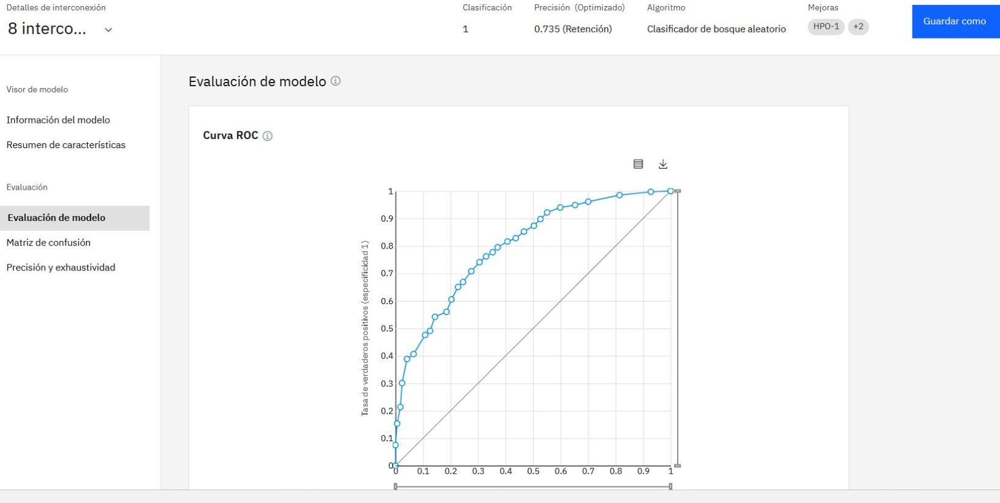

---

### 22. Revisión de la matriz de confusión

Finalmente, se revisó la matriz de confusión del modelo ganador.

La matriz de confusión permite comparar los valores observados contra los valores predichos por el modelo y ayuda a entender qué tipo de aciertos y errores está cometiendo.

**Evidencia:**

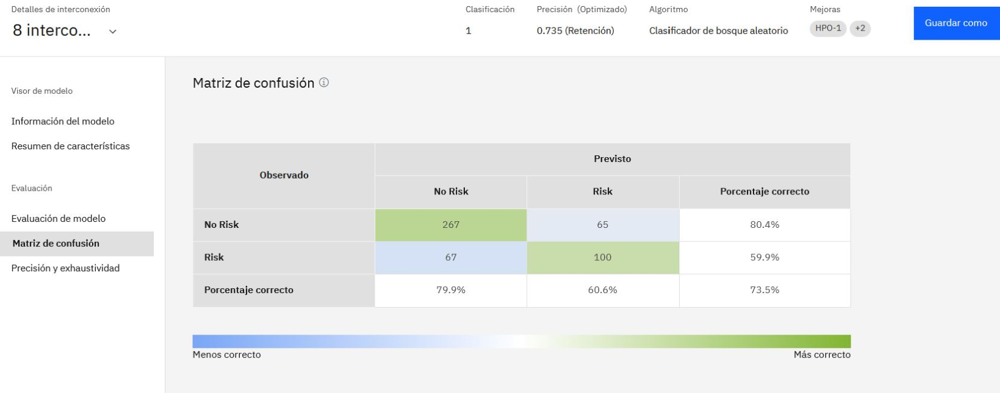

---

## Interpretación de la matriz de confusión

La matriz de confusión permite revisar cómo se comportó el modelo al comparar los valores observados contra los valores predichos. En este caso, el modelo obtuvo una precisión general de **73.5%**.

El modelo tuvo mejor rendimiento al clasificar casos **No Risk**, con un **80.4%** de acierto. Esto significa que identificó correctamente la mayoría de los solicitantes que no representaban riesgo. En cambio, para los casos **Risk**, el rendimiento fue menor, con un **59.9%** de acierto.

La matriz muestra que el modelo clasificó correctamente **267 casos No Risk** y **100 casos Risk**. También cometió errores: clasificó **65 casos No Risk como Risk** y **67 casos Risk como No Risk**.

En conclusión, el modelo generado por AutoAI ofrece una base funcional para predecir riesgo crediticio, pero todavía puede mejorarse, especialmente en la detección de casos realmente riesgosos. Un conjunto de datos más amplio, mejor balanceado o con ajustes adicionales podría ayudar a mejorar la precisión del modelo.

---

## Resultado del laboratorio

El laboratorio se completó correctamente.

Se logró:

* Crear un experimento AutoAI en IBM Watson Studio.
* Asociar una instancia de Watson Machine Learning.
* Seleccionar un dataset previamente cargado.
* Configurar la columna `Risk` como variable objetivo.
* Ejecutar un experimento de clasificación binaria.
* Generar varios modelos automáticamente.
* Identificar el modelo con mejor desempeño.
* Revisar la curva ROC.
* Interpretar la matriz de confusión.

---

## Acciones realizadas

| Acción                           | Descripción                                                                        |
| -------------------------------- | ---------------------------------------------------------------------------------- |
| Crear experimento AutoAI         | Se creó un nuevo experimento para generar modelos automáticos de Machine Learning. |
| Asociar Watson Machine Learning  | Se vinculó el servicio `Machine Learning-Risk_Fraud` al experimento.               |
| Seleccionar dataset              | Se utilizó el archivo `german_credit_data_biased_training.csv`.                    |
| Definir columna objetivo         | Se seleccionó `Risk` como columna de predicción.                                   |
| Configurar clasificación binaria | AutoAI identificó el problema como una clasificación de dos clases.                |
| Revisar algoritmos               | Se incluyeron algoritmos candidatos para que AutoAI generara modelos.              |
| Excluir característica           | Se excluyó la columna `Telephone` del entrenamiento.                               |
| Ejecutar experimento             | Se inició el procesamiento automático del experimento.                             |
| Revisar modelo ganador           | Se seleccionó el modelo marcado con estrella.                                      |
| Evaluar resultados               | Se revisaron la curva ROC y la matriz de confusión.                                |

---

## Comandos utilizados

En este laboratorio no se utilizaron comandos de terminal.

Todo el procedimiento se realizó mediante la interfaz gráfica de IBM Watson Studio y AutoAI.

| Acción en GUI                  | Función                                                                      |
| ------------------------------ | ---------------------------------------------------------------------------- |
| Nuevo activo                   | Permite crear un nuevo recurso dentro del proyecto de Watson Studio.         |
| AutoAI                         | Herramienta para crear experimentos automatizados de Machine Learning.       |
| Asociar servicio               | Vincula Watson Machine Learning con el experimento.                          |
| Seleccionar datos del proyecto | Permite usar un dataset previamente cargado en el proyecto.                  |
| Columna de predicción          | Define la variable que el modelo debe aprender a predecir.                   |
| Valores de experimento         | Permite ajustar configuración, algoritmos y características.                 |
| Ejecutar experimento           | Inicia el entrenamiento y comparación automática de modelos.                 |
| Matriz de confusión            | Muestra el rendimiento del modelo comparando valores observados y predichos. |

---

## Competencias demostradas

* Uso básico de IBM Watson Studio.
* Configuración de experimentos AutoAI.
* Asociación de Watson Machine Learning.
* Selección de datasets en proyectos cloud.
* Comprensión básica de Machine Learning supervisado.
* Identificación de una variable objetivo.
* Configuración de clasificación binaria.
* Revisión de algoritmos candidatos.
* Interpretación básica de curva ROC.
* Interpretación básica de matriz de confusión.
* Documentación técnica paso a paso.
* Uso de evidencias visuales para portafolio técnico.

---

## Valor profesional del laboratorio

Este laboratorio demuestra la capacidad de trabajar con una plataforma cloud de inteligencia artificial, preparar un experimento de Machine Learning, ejecutar modelos automáticos y revisar resultados básicos de evaluación.

Aporta evidencia práctica en áreas como:

* Inteligencia Artificial aplicada
* Análisis de datos
* Cloud básico
* Machine Learning automatizado
* Documentación técnica
* Interpretación inicial de métricas de modelos

---

## Conclusión

Se creó y ejecutó correctamente un experimento AutoAI en IBM Watson Studio utilizando el dataset `german_credit_data_biased_training.csv`.

AutoAI generó varios modelos candidatos, seleccionó un modelo ganador basado en la métrica de precisión y permitió revisar resultados mediante curva ROC y matriz de confusión.

El modelo obtuvo una precisión general de **73.5%** en la matriz de confusión revisada, mostrando mejor rendimiento para la clase `No Risk` que para la clase `Risk`.

El laboratorio permitió practicar el flujo completo de un experimento introductorio de Machine Learning: selección de datos, configuración del objetivo, ejecución automatizada, comparación de modelos e interpretación básica de resultados.
