# Lab: Creación de proyecto en IBM Watson Studio y carga de dataset

## Objetivo

Documentar el proceso de creación de un proyecto de inteligencia artificial en IBM Watson Studio, utilizando IBM Cloud para aprovisionar los recursos necesarios y cargar un conjunto de datos en formato CSV.

El objetivo del laboratorio fue preparar un entorno básico de trabajo para un proyecto de Machine Learning, asociando almacenamiento en la nube, Watson Studio, Watson Machine Learning y un dataset de práctica.

## Entorno utilizado

* IBM Cloud
* IBM Watson Studio
* IBM Watson Machine Learning
* IBM Cloud Object Storage
* Navegador web
* Dataset: `german_credit_data_biased_training.csv`

## Descripción del laboratorio

En este laboratorio se creó un proyecto llamado `Risk_Fraud` dentro de IBM Watson Studio. Para ello, primero se aprovisionó un recurso de almacenamiento en IBM Cloud Object Storage, luego se configuró Watson Studio y posteriormente se creó un servicio de Watson Machine Learning en la misma región.

Finalmente, se cargó el archivo `german_credit_data_biased_training.csv` dentro del proyecto y se validó que el dataset pudiera visualizarse correctamente desde la vista previa de Watson Studio.

## Procedimiento realizado

### 1. Acceso al catálogo de IBM Cloud

Se ingresó al catálogo de IBM Cloud para buscar los servicios necesarios para el laboratorio.

**Evidencia:**

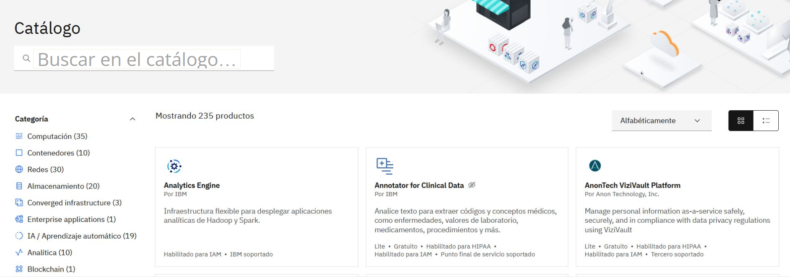

### 2. Búsqueda de Object Storage

Se buscó el servicio `Object Storage` dentro del catálogo de IBM Cloud utilizando el término “almacén de objetos”.

Este servicio permite almacenar archivos y datos que luego pueden ser utilizados por proyectos en Watson Studio.

**Evidencia:**

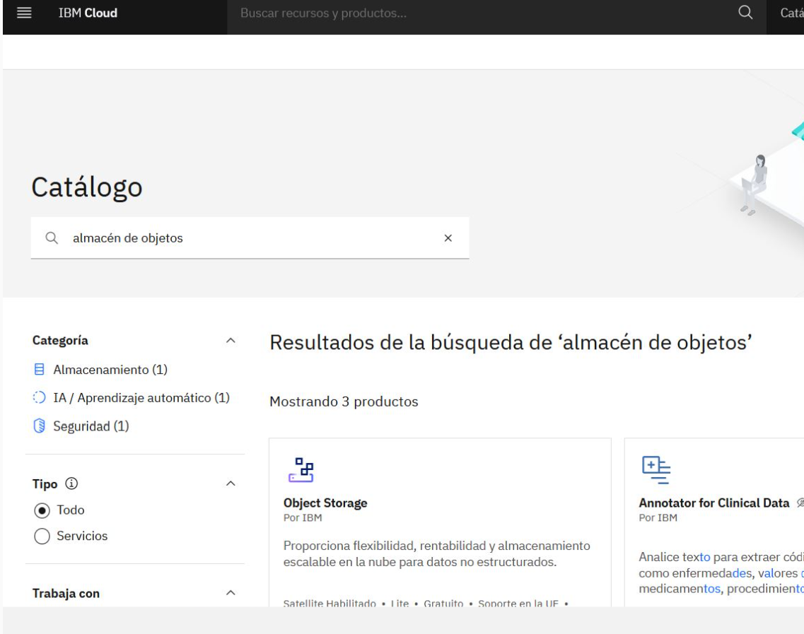

### 3. Configuración de Cloud Object Storage

Se configuró el recurso de almacenamiento con el nombre:

```text
Cloud Object Storage-Risk_Fraud
```

Se utilizó el plan `Lite`, identificado como gratuito dentro de IBM Cloud.

**Evidencia:**

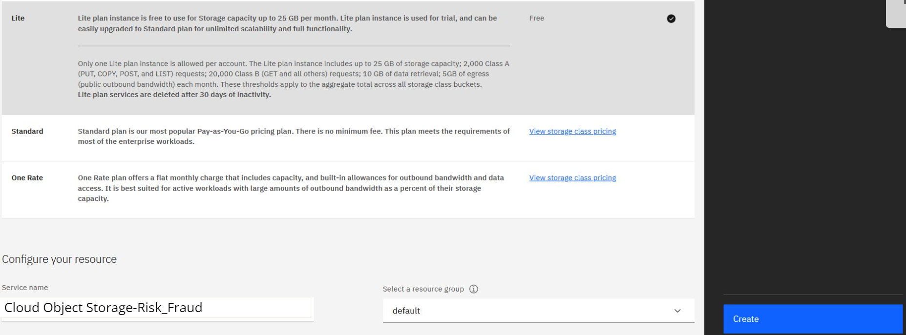

### 4. Validación del recurso de almacenamiento creado

Después de crear el recurso, se verificó desde la lista de recursos de IBM Cloud que el almacenamiento apareciera correctamente en la categoría `Almacenamiento`.

**Evidencia:**

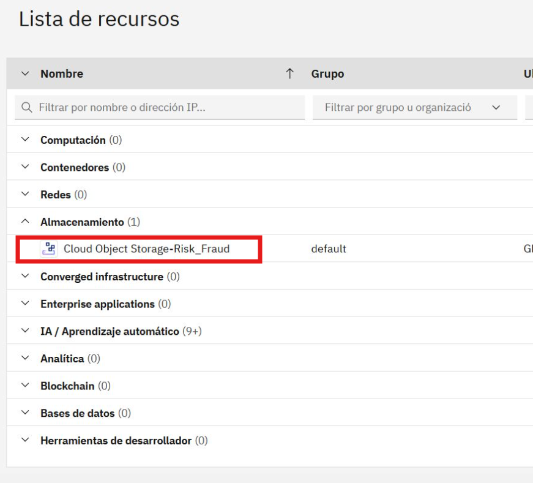

### 5. Selección de la categoría IA / Aprendizaje automático

Se volvió al catálogo de IBM Cloud y se filtró la categoría `IA / Aprendizaje automático` para localizar los servicios relacionados con inteligencia artificial y Machine Learning.

Dentro de esta categoría se seleccionó `Watson Studio`.

**Evidencia:**

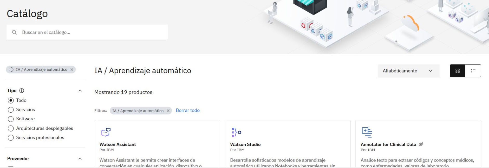

### 6. Configuración de Watson Studio

Se configuró el servicio IBM Watson Studio con el nombre:

```text
Fundamentos de Watson Studio-IA
```

Se seleccionó la región `Frankfurt` y el plan `Lite`.

**Evidencia:**

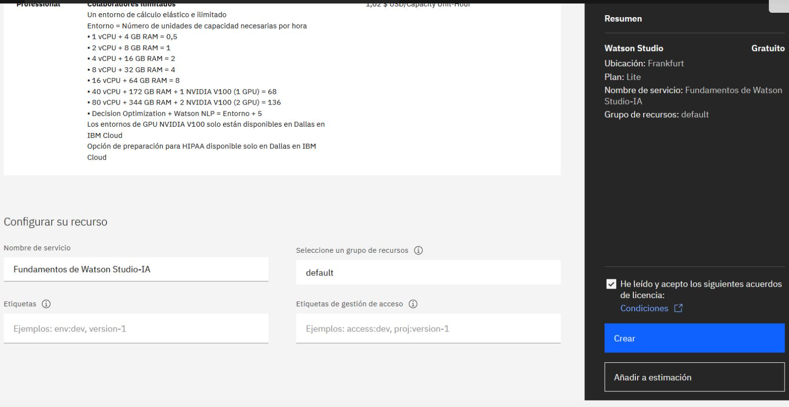

### 7. Inicio del asistente para crear y gestionar modelos ML

Después de crear Watson Studio, se accedió al asistente para crear y gestionar modelos de Machine Learning.

En este paso se seleccionó la opción para suministrar Watson Machine Learning.

**Evidencia:**

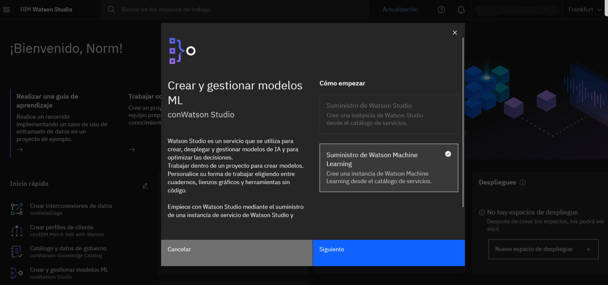

### 8. Selección de región para Watson Machine Learning

Se verificó que Watson Machine Learning utilizara la misma región que Watson Studio:

```text
Frankfurt
```

Mantener la misma región ayuda a que los servicios trabajen correctamente dentro del mismo entorno de IBM Cloud.

**Evidencia:**

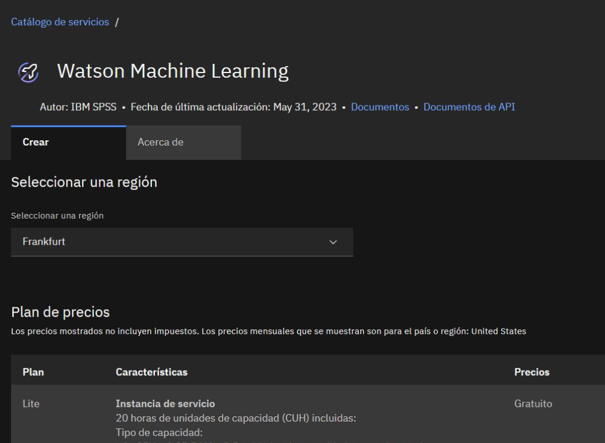

### 9. Configuración de Watson Machine Learning

Se configuró el servicio de Watson Machine Learning con el nombre:

```text
Machine Learning-Risk_Fraud
```

Este servicio permite preparar el entorno para trabajar posteriormente con modelos de Machine Learning.

**Evidencia:**

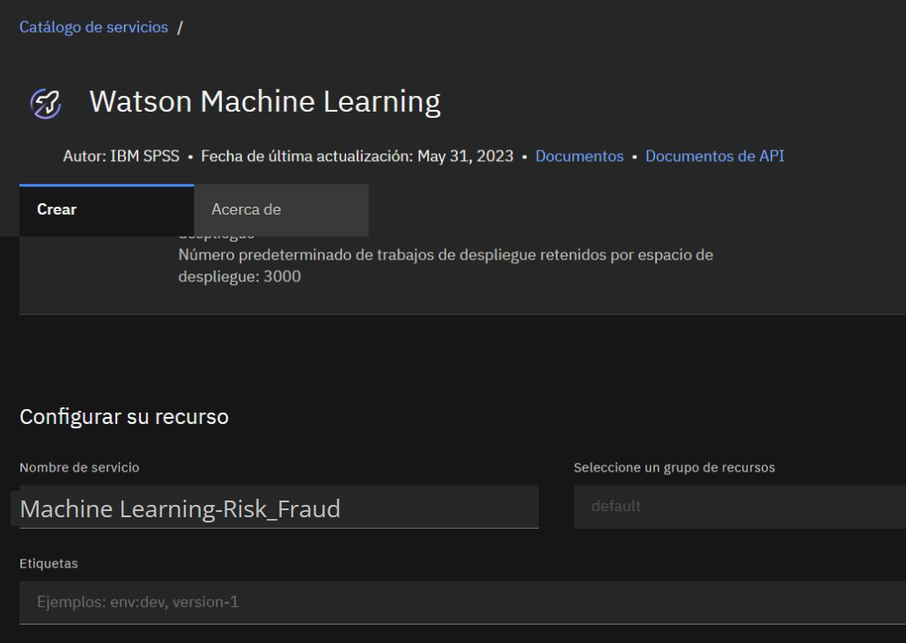

### 10. Creación de un nuevo proyecto

Dentro de Watson Studio se seleccionó la opción `Nuevo proyecto`, con el objetivo de crear un espacio vacío donde cargar datos y trabajar con activos del proyecto.

**Evidencia:**

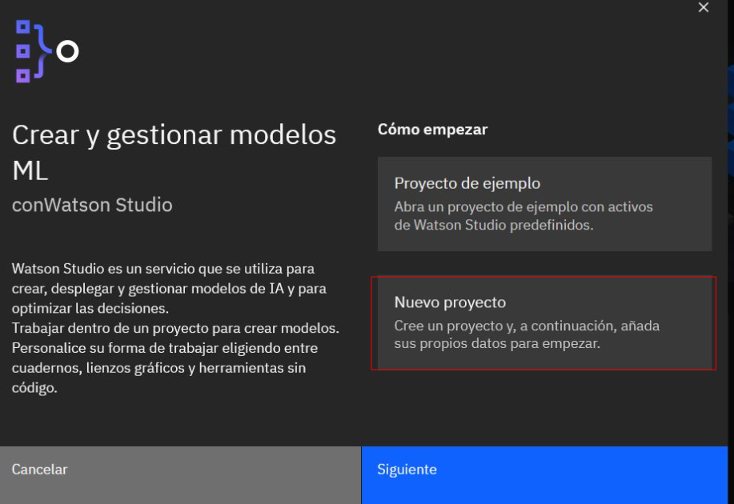

### 11. Definición de detalles del proyecto

Se creó el proyecto con el nombre:

```text
Risk_Fraud
```

También se verificó que el proyecto quedara asociado al almacenamiento:

```text
Cloud Object Storage-Risk_Fraud
```

**Evidencia:**

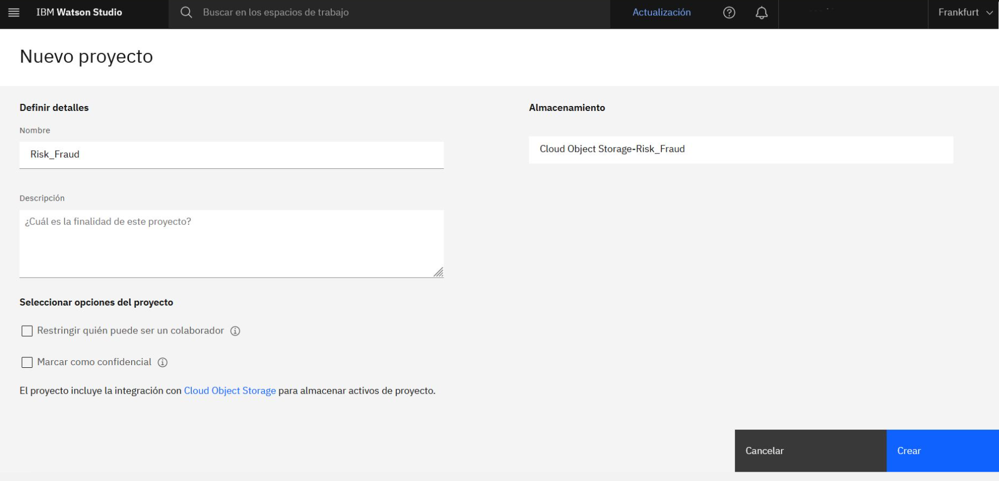

### 12. Validación del proyecto creado

Después de crear el proyecto, se validó que apareciera correctamente en IBM Watson Studio con el nombre `Risk_Fraud`.

**Evidencia:**

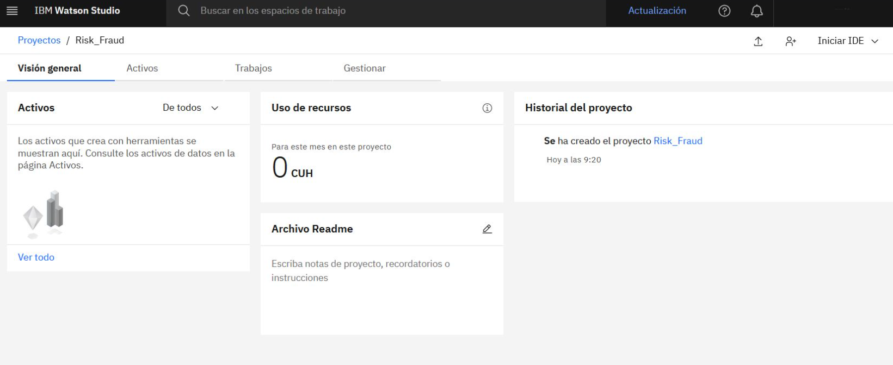

### 13. Carga del dataset CSV

En la pestaña `Activos`, se cargó el archivo:

```text
german_credit_data_biased_training.csv
```

Después de la carga, el archivo apareció como un activo de tipo `CSV` dentro del proyecto.

**Evidencia:**

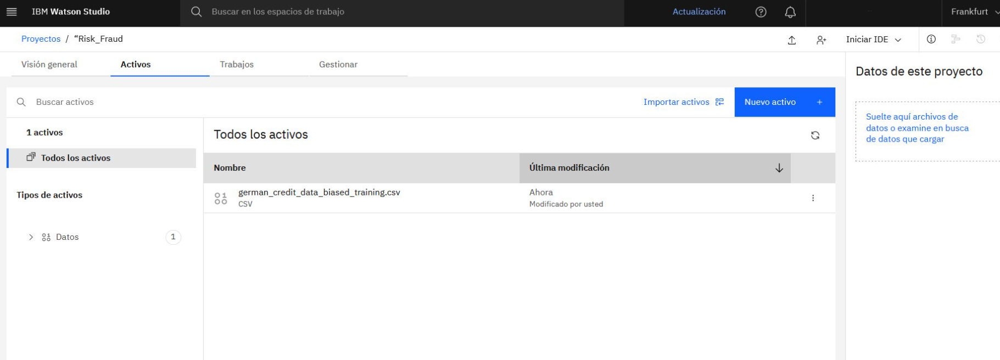

### 14. Vista previa del dataset

Se abrió el archivo CSV desde Watson Studio para validar que el dataset se hubiera cargado correctamente.

La vista previa mostró un conjunto de datos con:

```text
21 columnas
1000 filas
```

Algunas columnas visibles fueron:

* `CheckingStatus`
* `LoanDuration`
* `CreditHistory`
* `LoanPurpose`
* `LoanAmount`
* `Sex`

**Evidencia:**

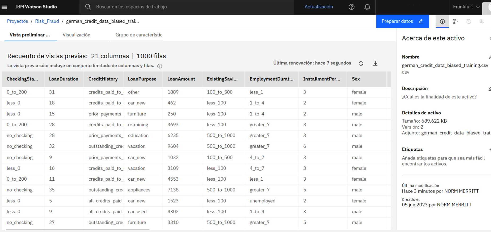

## Resultado

El laboratorio se completó correctamente.

Se creó un entorno básico de trabajo en IBM Watson Studio, se aprovisionaron los servicios necesarios en IBM Cloud y se cargó correctamente el dataset `german_credit_data_biased_training.csv`.

El proyecto `Risk_Fraud` quedó preparado para continuar con procesos posteriores de análisis de datos o creación de modelos de Machine Learning.

## Acciones realizadas

El procedimiento se realizó mediante la interfaz gráfica de IBM Cloud y IBM Watson Studio.

Las acciones principales fueron:

| Acción                | Descripción                                                                                       |
| --------------------- | ------------------------------------------------------------------------------------------------- |
| Buscar en catálogo    | Se utilizó el buscador de IBM Cloud para localizar servicios como Object Storage y Watson Studio. |
| Crear recurso         | Se aprovisionaron servicios cloud necesarios para el laboratorio.                                 |
| Seleccionar región    | Se configuró Frankfurt como región para mantener consistencia entre servicios.                    |
| Crear proyecto        | Se generó un proyecto vacío en Watson Studio para trabajar con datos.                             |
| Cargar archivo CSV    | Se subió el dataset al proyecto desde la pestaña Activos.                                         |
| Vista previa de datos | Se validó que Watson Studio pudiera leer y mostrar el contenido del CSV.                          |

## Competencias demostradas

* Uso básico de IBM Cloud.
* Aprovisionamiento de servicios cloud.
* Configuración inicial de IBM Watson Studio.
* Configuración de Watson Machine Learning.
* Asociación de almacenamiento cloud a un proyecto.
* Carga de datasets en formato CSV.
* Validación de datos desde una plataforma de IA.
* Documentación técnica paso a paso.
* Preparación inicial de un entorno para Machine Learning.

## Valor profesional del laboratorio

Este laboratorio demuestra capacidad para seguir un flujo técnico en una plataforma cloud, crear recursos de trabajo para inteligencia artificial y preparar un proyecto con datos estructurados.

Aunque el laboratorio no desarrolla todavía un modelo predictivo, sí cubre una etapa importante en proyectos de datos e IA: la preparación del entorno, la organización de recursos y la carga inicial del dataset.

## Conclusión

Se logró crear correctamente un proyecto en IBM Watson Studio llamado `Risk_Fraud`, asociado a IBM Cloud Object Storage y preparado para trabajar con el dataset `german_credit_data_biased_training.csv`.

El laboratorio permitió practicar el uso de servicios cloud, la configuración de recursos de IA y la carga de datos dentro de un entorno de Machine Learning.

Como siguiente paso, este proyecto puede ampliarse con exploración de datos, preparación del dataset, entrenamiento de un modelo y evaluación de resultados.
